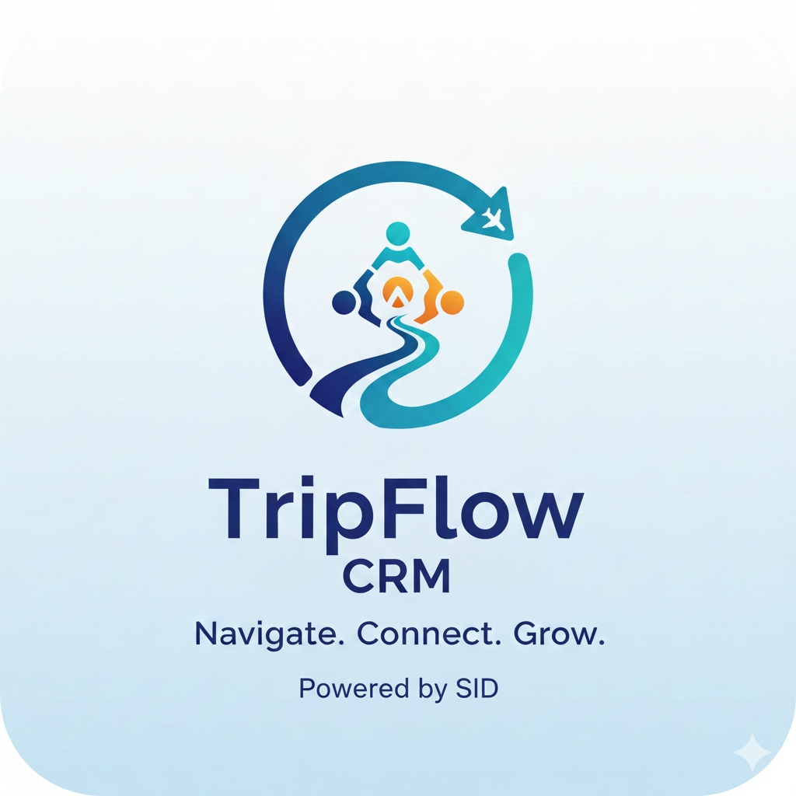

<div align="center">
  
  <h1>TripFlow CRM</h1>
  <p><strong>The Ultimate Productivity Suite for Modern Travel Agents</strong></p>
  
  <p align="center">
    <a href="#features">Features</a> •
    <a href="#installation">Installation</a> •
    <a href="#usage-guide">Usage Guide</a> •
    <a href="#google-integration">Google Integration</a> •
    <a href="#license">License</a>
  </p>

  
  
  
  
  
</div>

---

## 🚀 Overview

**TripFlow CRM** is a cutting-edge, purpose-built CRM and itinerary management system designed to streamline the workflow of travel agencies. It replaces fragmented tools (Excel, Word, random PDF editors) with a unified, intelligent platform.

From capturing leads to generating stunning, transparency-focused itineraries and managing payments, TripFlow handles it all. Powered by **Google Gemini AI**, it automates the tedious task of converting raw vendor chatter into polished client proposals.

---

## ✨ Key Features

### 🤖 AI-Powered Intelligence
*   **Raw Text to Quote**: Paste unorganized text from WhatsApp or vendor chats, and our AI instantly structures it into a beautiful day-wise itinerary.
*   **Smart Parsing**: Automatically detects destinations, dates, hotels, and inclusions with high accuracy.
*   **Persistent Context**: Original vendor inputs are saved for every revision, ensuring you never lose the source data.

### 📝 Dynamic Workspace
*   **Real-time Preview**: See changes instantly as you edit. What you see is exactly what the client gets.
*   **Transparency First**: Unique "Problem/Solution" transparency section built into every quote to build trust and authority.
*   **Flexible Templates**: Easily toggle inclusions, exclusions, and terms of service.

### 💰 Professional Financial Suite
*   **Precision Calculator**: Detailed breakdown of Pax costs, GST, TCS, and dynamic markups.
*   **Profit Analysis**: Instant visibility into Net Earnings vs. Vendor Payables.
*   **Multi-Option Builder**: Present Budget, Standard, and Luxury options in a single unified view.
*   **Excel Export**: One-click generation of internal financial audit sheets.

### 💳 Payment & Branding
*   **Dynamic Branding Management**: Personalize your quotations with your agency's name, bank details, and logo.
*   **AI-OCR Bank Registration**: Upload a screenshot of your bank details, and Gemini AI automatically populates your payment configuration.
*   **Cloud-Synced Settings**: Your agency's profile and payment details are securely stored in Supabase and synced across all devices.
*   **Ledger System**: Professional tracking of client receipts and vendor disbursements.
*   **Automatic Sync**: Update a lead's status or name once, and see it reflected across all documents and receipts.

### 🖼️ Testimonial Poster Generator
*   **Heartfelt Feedback**: Generate natural, simple, and grateful client testimonials using AI.
*   **Visual Poster**: Create stunning, branded testimonial posters with client images and destination backdrops.
*   **Revision History**: Save and manage multiple versions of testimonials for every lead.
*   **One-Click Download**: Export testimonials as high-quality PNGs for social media sharing.

### ☁️ Deep Google Integration
*   **Intelligent Drive Sync**: Automated organization: `Destination > Client Name > Documents`.
*   **Native Docx Support**: Generates standard `.docx` files that are fully editable in Word or Google Docs.
*   **Cloud Revisions**: Automatically track and pull previous versions directly from Google Drive.

> **Note on Templates**: Currently, the system supports a single, high-conversion "Transparency" template. We are actively working on a multi-template engine to support diverse branding needs in upcoming updates.

---

## 🛠 Installation & Setup

Follow these steps to set up TripFlow CRM on your local machine.

### Prerequisites
- Node.js (v18 or higher)
- npm or yarn
- A [Supabase](https://supabase.com/) account (Free tier is sufficient)
- A [Google Cloud](https://console.cloud.google.com/) account

### 1. Database Setup (Supabase)

TripFlow uses Supabase for storing leads and quotation data.

1.  **Create a Project**: Log in to Supabase and create a new project.
2.  **SQL Editor**: Navigate to the SQL Editor in your dashboard.
3.  **Run Scripts**: We provide organized SQL scripts in the `supabase_schemas/` folder. For a fresh setup, run them in this order:

| Script | Description |
| :--- | :--- |
| `supabase_main.sql` | **Recommended**: Master script that sets up all tables (Leads, Workspaces, Settings, Templates) and RLS policies. |
| `supabase_leads.sql` | Separate script for just the `leads` table. |
| `supabase_workspaces.sql` | Separate script for just the `workspaces` table. |
| `supabase_testimonial.sql` | Migrations for the new Testimonial state (Run this if you have an existing DB). |
| `supabase_settings.sql` | Standalone script for the `settings` table. |

> **Pro Tip**: If you are setting up for the first time, simply copy the content of `supabase_main.sql` and run it.

4.  **Get Credentials**: Go to **Project Settings > API**. Copy the `Project URL` and `anon public` key. You will need these for the `.env` file.

    
    *(Place `supabase-keys-placeholder.png` in your assets folder)*

### 2. Google Integration Setup

To enable Google Drive sync and Docx generation, you need a Google Cloud Project.

1.  **Create Project**: Go to [Google Cloud Console](https://console.cloud.google.com/) and create a new project named "TripFlow CRM".
2.  **Enable APIs**:
    *   Search for **"Google Drive API"** and **"Gmail API"**.
    *   Click **Enable** for both.
3.  **Configure OAuth Screen**:
    *   Go to **APIs & Services > OAuth consent screen**.
    *   Select **External** -> Create.
    *   Fill in App Name ("TripFlow") and User Support Email.
    *   **Scopes**: Add `.../auth/drive.file` and `.../auth/gmail.send`.
    *   **Test Users**: Add your own email address so you can log in during development.
4.  **Create Credentials**:
    *   Go to **Credentials > Create Credentials > OAuth client ID**.
    *   Application Type: **Web application**.
    *   **Authorized JavaScript origins**: `http://localhost:5173` (or your dev port).
    *   **Authorized redirect URIs**: `http://localhost:5173`
    *   Copy the **Client ID** and **Client Secret** (Client Secret is not used in frontend, but keep it safe).
    *   Also, create an **API Key** from the Credentials page for generic usage.

    
    *(Place `google-console-placeholder.png` in your assets folder)*

### 3. Local Installation

1.  **Clone the Repository**
    ```bash
    git clone https://github.com/yourusername/tripflow-crm.git
    cd tripflow-crm
    ```

2.  **Install Dependencies**
    ```bash
    npm install
    ```

3.  **Environment Setup**
    Create a `.env` file in the root directory and fill in your keys:
    ```env
    VITE_SUPABASE_URL=your_supabase_url_from_step_1
    VITE_SUPABASE_ANON_KEY=your_supabase_anon_key_from_step_1
    VITE_GOOGLE_CLIENT_ID=your_google_client_id_from_step_2
    VITE_GOOGLE_API_KEY=your_google_api_key_from_step_2
    VITE_GEMINI_API_KEY=your_gemini_api_key_for_ai
    ```

4.  **Run Development Server**
    ```bash
    npm run dev
    ```

---

---

## 🏗️ Professional Workflow Tutorial

Follow this step-by-step guide to maximize your agency's productivity with TripFlow CRM.

### Step 0: Initial Setup & Profile
1.  **First Launch**: On your first launch, the app will prompt you with a **Setup Profile** screen.
2.  **Agency Branding**: Enter your **Company Name**. This will be used for all quotation headers and collaboration messages.
3.  **Payment Configuration**: Enter your bank details. 
    *   **Pro Tip**: Use the **"Snap & Auto-Fill"** button and upload a screenshot of your bank details or GPay QR—Gemini AI will extract and fill the fields for you instantly.
4.  **Save & Sync**: Your profile is now saved to Supabase and will be used for every quotation. You can update this anytime via the **Settings (⚙️)** button in the Dashboard.

### Step 1: Initialize a New Inquiry
1.  **Dashboard**: Start at the main dashboard and click the **"Create New Inquiry"** button.
2.  **Input Details**: A modal will appear. Input the client's core details:
    *   **Client Name**: e.g., "Alex Test"
    *   **Destination**: e.g., "Switzerland"
    *   **Travel Dates & Pax**: Essential for accurate AI calculations.
3.  **Scroll & Finalize**: Ensure you scroll down the modal to capture all requirements in the **Notes** section (e.g., "Preference for mountain view hotels").
4.  **Create**: Click **"Create Inquiry"** to add the lead to your workspace.

### Step 2: Transform Vendor Data to Itinerary
1.  **Open Workspace**: Click on your newly created lead card in the dashboard.
2.  **Vendor Input**: In the **Quotation** tab, you'll see a text area on the left. Paste your raw vendor chat or unformatted itinerary here.
3.  **Generate**: Click the **"Generate Proposal"** button.
4.  **AI Magic**: Our Gemini-powered engine will instantly structure the raw text into a day-wise itinerary, identifying hotels, transfers, and activities automatically.

### Step 3: Financial Precision & Margins
1.  **Financials Tab**: Switch to the **Financials** tab to define your pricing.
2.  **Itemize Costs**: Enter net rates for Land, Flights, and Visa.
3.  **Apply Markup**: Set your desired markup percentage. The system auto-calculates GST (5%) and TCS (5%/20%) to ensure your final quote is mathematically sound.
4.  **Sync**: Click **"Update Quote"** to push these numbers into the final proposal document.

### Step 4: One-Click Export & Cloud Sync
1.  **Review**: Check the live preview on the right side of the Quotation tab.
2.  **Download DOCX**: Click the **"Download DOCX"** button to get a perfectly formatted Microsoft Word file for your client.
3.  **Save to Drive**: Click **"Save to Drive"** to automatically archive the document in your Google Drive under the structured folder: `TripFlow Quotations > [Destination] > [Client Name]`.

### Step 5: AI Smart Summary for WhatsApp
1.  **Summary Tab**: Navigate to the **Summary** tab.
2.  **Generate AI Summary**: Click the **"✨ Smart Summary"** button.
3.  **WhatsApp Ready**: Friendly, emoji-rich, and concise text will be generated, ready to be copied or sent directly via the **"WhatsApp"** button.

### Step 6: Generate Social Media Testimonials
1.  **Testimonial Tab**: Once the trip is completed, visit the **Testimonial** tab.
2.  **Branding**: Upload a photo of your happy clients.
3.  **AI Feedback**: Toggle "Emphasis" (e.g., Grateful, Food, Hotels) and click **"Generate AI Feedback"**.
4.  **Social Sharing**: Click **"Download PNG"** to get a premium-branded poster for your Instagram or WhatsApp status.

---

## 🔐 Google Workspace Deep Integration
TripFlow uses the Google Drive API to keep your files organized.

- **Scopes Used**: `drive.file` (to create/edit its own files), `gmail.send` (optional, for emailing).
- **Folder Structure**:
  ```
  TripFlow Quotations/
  ├── Dubai/
  │   ├── John Doe/
  │   │   ├── Quote_John_Doe.docx
  │   │   ├── Financials_John_Doe.xlsx
  │   └── Jane Smith/
  └── Switzerland/
      └── Alex Test/
  ```

---

## 📄 License

Distributed under the MIT License. See `LICENSE` for more information.

---

<div align="center">
  <small>Built with ❤️ by TripExplore Innovations</small>
</div>

# TripFlow-CRM
TripFlow CRM: The AI OS for travel agents. Turn raw vendor chats into professional itineraries with Gemini AI. Includes smart financial calculators, automated Google Drive sync, and one-click DOCX/WhatsApp summaries
